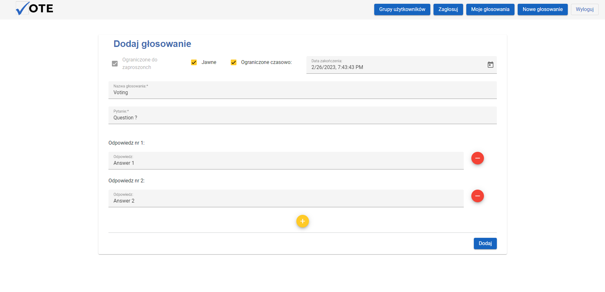
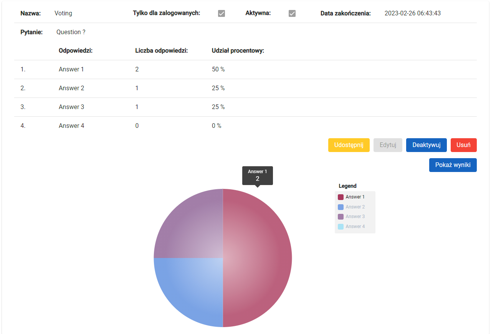

# Voting Application

This is my voting application project, it was originally created for my Engineering work, this is frontend part of that application.
I have learned a lot during creation of this project. After first version of application I learned about frontend programming, and I decided to use my knowledge to fix this app.
## Description
The project is a voting application that allows you to create votes, share them and check the results you have received.
We can create user and user can create voting and share it to other users and non-user players using link.
User can share voting to single user or can create user groups and share voting to all users in group.
Voting can be time limited, another option is that voting can be open or hidden,
when voting is open user after voting can see results when result is hidden only user that created voting can see result.
## Screenshots






## Technologies
* Angular
* RxJS
* Angular materials
* Bootstrap
* Ngx-Charts

## How to run application

### Running app in docker compose

The easiest way to run application is to use docker-compose.
* Open folder docker-compose in terminal
* Run command:
```
$ docker-compose up -d --build
```
* Application will start and frontend application will be available on http://localhost:4200

### Running app using from project

#### Running backend using docker-compose
* Open folder docker-compose in terminal
* Run commands:
```
$ docker-compose up -d --build db
$ docker-compose up -d --build backend-app
```
#### Running frontend using docker-compose
* Open project folder in terminal
* Run command:```npm install```
* When installing ends run ```npm start```
* Application will start on port ```4200```

#### Backend application can be found on my GitHub: https://github.com/Sosna213/Voting-application
